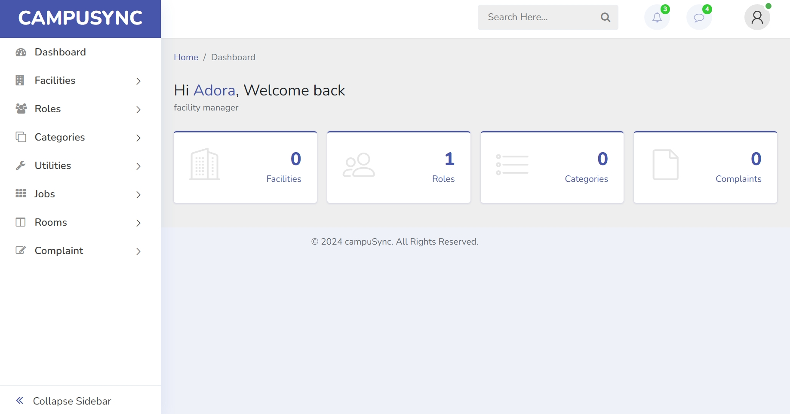

# CampuSync

CampuSync is a Facilities Management System designed specifically for higher institutions and organizations in Nigeria. It streamlines the management of utilities and maintenance tasks, providing a comprehensive solution to track the maintenance lifecycle of facilities.



## Table of Contents

- [Introduction](#introduction)
- [Features](#features)
- [Technologies Used](#technologies-used)
- [Installation](#installation)
- [Usage](#usage)
- [Contributing](#contributing)
- [License](#license)
- [Contact](#contact)
- [Demo](#try-it-here)

## Introduction

CampuSync is developed to help higher institutions in Nigeria manage their facilities efficiently. It provides features such as utility maintenance lifecycle tracking, task management, and real-time notifications to ensure that maintenance tasks are completed promptly.

## Features

- Utility Maintenance Lifecycle Tracking
- Task Management
- Real-time Notifications
- User Authentication and Authorization
- Dashboard and Reporting
- Role-Based Access Control
- Documentation and Support

## Technologies Used

- **Frontend**: HTML, CSS, JavaScript
- **Backend**: PHP (Laravel)
- **Database**: MySQL
- **Authentication**: Laravel Breeze
- **Version Control**: Git

## Installation

### Prerequisites

- PHP >= 7.4
- Composer
- MySQL
- Node.js and npm

### Steps

1. **Clone the repository:**

    ```bash
    git clone https://github.com/adoraa/campusync.git
    cd campussync
    ```

2. **Install dependencies:**

    ```bash
    composer install
    npm install
    ```

3. **Create a copy of your `.env` file:**

    ```bash
    cp .env.example .env
    ```

4. **Generate an application key:**

    ```bash
    php artisan key:generate
    ```

5. **Configure your `.env` file:**

    Update your database and other configuration settings in the `.env` file.

6. **Run the database migrations:**

    ```bash
    php artisan migrate
    ```

7. **Start the local development server:**

    ```bash
    php artisan serve
    npm run dev
    ```

## Usage

### Accessing the Application

Visit `http://localhost:8000` in your web browser to access the application.

### User Authentication

- Register a new account or log in with existing credentials.
- Access different features based on your user role (e.g., Admin, Maintenance Staff, etc.).

## Contributing

We welcome contributions from the community! Please follow these steps to contribute:

1. Fork the repository.
2. Create a new branch (`git checkout -b feature/your-feature-name`).
3. Commit your changes (`git commit -am 'Add some feature'`).
4. Push to the branch (`git push origin feature/your-feature-name`).
5. Create a new Pull Request.

## License

This project is licensed under the MIT License. See the [LICENSE](LICENSE) file for more details.

## Contact

For any questions or feedback, please contact us at:

- **Email**: support@campusync.com

## Try it here : [csync](http://csync.000.pe/)